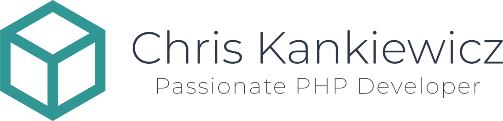

    

    
    
    

---

Requirements
------------

  - [PHP](https://secure.php.net/) >= 8.0
  - [MySQL](https://www.mysql.com/) >= 5.7
  - [Node.js](https://nodejs.org) >= 14.0

#### For development

  - [Composer](https://getcomposer.org/)
  - [Docker](https://www.docker.com/)
    - [Docker Compose](https://docs.docker.com/compose/)
  - [SQLite](https://www.sqlite.org/index.html)
    - `php-sqlite3` PHP extension

Setting up a Local Development Environment
------------------------------------------

### Configure the Hostnames

Add the following entry to `/etc/hosts`:

    127.0.0.1  chriskankiewicz.local mysql redis

### Set Environment Variables

To set up your local environment variables copy `.env.example` to `.env` then
generate your application key.

    cp .env.example .env
    artisan key:generate

Once done you must set the remaining variables in the `.env` file.

### Start the Docker Environment

To build and start the containers on your system for the first time run the
following from the project's root directory:

    docker-compose up -d

## Install PHP dependencies

    composer install

or from within the Docker container:

    docker run -it --rm --env-file ${PWD}/.env --user $(id -u):$(id -g) --volume ${PWD}:/app composer:1.9 \
        composer config --global http-basic.nova.laravel.com ${NOVA_USERNAME} ${NOVA_PASSWORD} \
        && composer install --working-dir /app --ignore-platform-reqs --no-cache --no-interaction --no-scripts

## Install and Compile CSS and JavaScript Assets

    npm install && npm run dev

or from within the Docker container:

    docker run -it --rm --env-file ${PWD}/.env --user $(id -u):$(id -g) --volume ${PWD}:/app node:12.10 \
        npm config set "@fortawesome:registry" https://npm.fontawesome.com/ \
        && npm config set "//npm.fontawesome.com/:_authToken" ${FONT_AWESOME_TOKEN} \
        && npm install && npm run dev

> #### ℹ️ Watching for Changes
>
> You can watch for changes to assets and re-compile automatically during
> development by running:
> 
>     npm run watch

### Initialize the Database

Run the migrations and seed the database.

    docker-compose exec php artisan migrate

### Accessing the Development Site

You can access the development site at <http://chriskankiewicz.local>.

## Debugging

### Laravel Telescope

[Laravel Telescope](https://laravel.com/docs/telescope) is included in local
environments for debugging. Telescope provides insight into the requests coming
into your application, exceptions, log entries, database queries, queued jobs,
mail, notifications, cache operations, scheduled tasks, variable dumps and more.

You can access Telescope via <http://chriskankiewicz.local/telescope>

### Tailing Application Logs

    docker-compose logs --follow --tail 20 app
