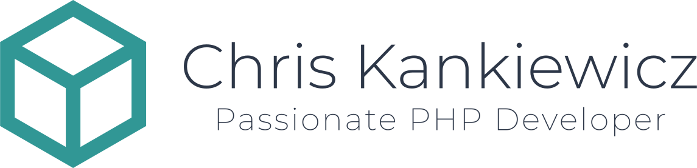
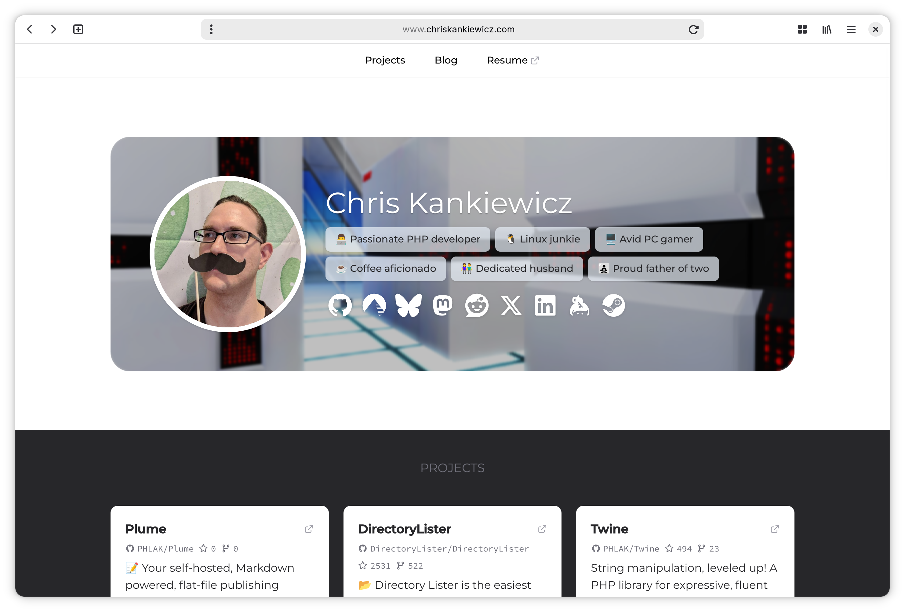

    

    
    
    

--

    Home page of Chris Kankiewicz.

Requirements
------------

  - [PHP](https://secure.php.net/)
  - [Node.js](https://nodejs.org/) (npm)
  - [Composer](https://getcomposer.org/)
  - [Docker](https://www.docker.com/)
    - [Docker Compose](https://docs.docker.com/compose/)

Setting up a Local Development Environment
------------------------------------------

### Set Environment Variables

To set up your local environment variables copy `.env.example` to `.env` and
set the required values.

    cp .env.example .env

At minimum, set a valid `GITHUB_TOKEN` for fetching project data from GitHub.

### Install Dependencies

    make dev

Or manually

    composer install
    npm install

### Start the Docker Environment

To build and start the containers on your system for the first time run the
following from the project's root directory:

    docker compose up -d

This will start the application and Valkey containers.

### Accessing the Development Site

You can access the development site at <http://localhost>.

License
-------

This project is licensed under the [Creative Commons Attribution-NonCommercial-ShareAlike 4.0 International License](https://creativecommons.org/licenses/by-nc-sa/4.0/).
